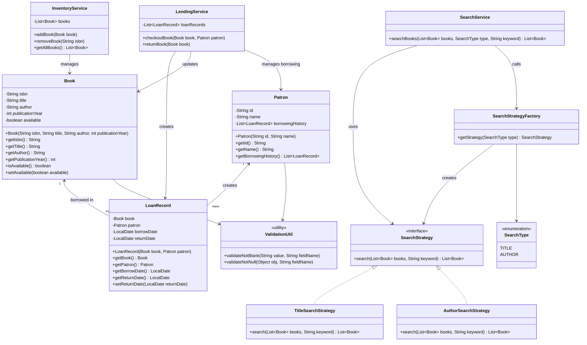

# Library Management System

## Overview

This project is a Java-based Library Management System designed using Object-Oriented Programming (OOP), SOLID principles, and design patterns.

The system helps librarians manage:
- Books
- Patrons
- Lending process
- Inventory
- Search functionality

---

## Features

### Book Management
- Add books
- Remove books
- Search books by:
    - Title
    - Author

### Patron Management
- Add patrons
- Track borrowing history

### Lending Process
- Checkout books
- Return books
- Track borrowed books

### Inventory Management
- Maintain available and borrowed books

---

## Design Patterns Used

### Strategy Pattern
Used for implementing different search algorithms:
- Title search
- Author search

### Factory Pattern
Used to create search strategies dynamically.

---

## SOLID Principles Applied

### Single Responsibility Principle
Each service handles only one responsibility.

### Open Closed Principle
New search strategies can be added without modifying existing code.

### Dependency Inversion Principle
Services depend on abstractions instead of concrete implementations.

---

## Project Structure

src/main/java/com/library

- model
- service
- strategy
- factory
- util

---

## Technologies Used

- Java 17
- Gradle
- JUnit 5
- IntelliJ IDEA

---

## How to Run

1. Clone repository
2. Open in IntelliJ
3. Run Main.java

---

## Running Tests

Run test classes from:
src/test/java

---

## Future Enhancements

- Reservation system
- Notification system
- Recommendation engine
- Multi-branch support
- Database integration

---

## Author

Amit Sharma

# Library Management System - UML Class Diagram

## UML Diagram

---

## Key Design Concepts Represented

### Strategy Pattern

* `SearchStrategy`
* `TitleSearchStrategy`
* `AuthorSearchStrategy`

Supports extensible search functionality.

### Factory Pattern

* `SearchStrategyFactory`

Centralized strategy creation.

### SOLID Principles

* Inventory responsibilities separated from lending.
* Search behavior abstracted.
* Services depend on abstractions.

### Composition Relationships

* `LoanRecord` contains `Book` and `Patron`
* `InventoryService` manages `Book`
* `LendingService` manages `LoanRecord`
