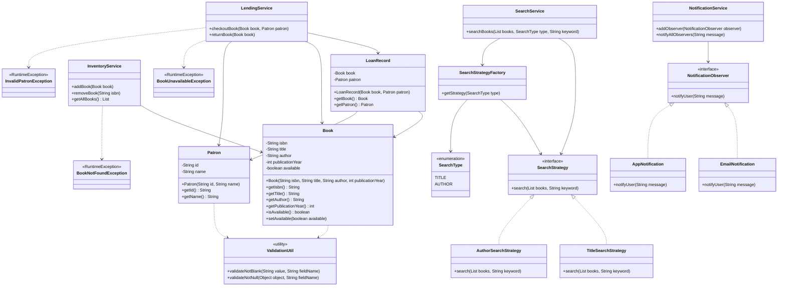

# Library Management System

## Overview

Library Management System is a Java-based Low Level Design (LLD) project developed using Object-Oriented Programming (OOP), SOLID principles, and design patterns.

The system helps librarians manage:
- Books
- Patrons
- Lending operations
- Inventory tracking
- Search functionality
- Notifications

This project demonstrates clean architecture, modular design, extensibility, and professional coding practices.

---

# Features

## 1. Book Management
- Add books
- Remove books
- View all books
- Maintain book availability

## 2. Patron Management
- Add patrons
- Track patron borrowing history

## 3. Lending Process
- Checkout books
- Return books
- Prevent already borrowed books from being issued

## 4. Inventory Management
- Track available books
- Track borrowed books

## 5. Search Functionality
Supports searching books by:
- Title
- Author

Search logic is extensible using Strategy Pattern.

## 6. Notification System
Observer Pattern is used for notifications.

Current notification channels:
- Email Notification
- App Notification

New notification channels can be added without modifying existing code.

---

# Design Patterns Used

## 1. Strategy Pattern
Used for implementing different search algorithms.

Strategies:
- `TitleSearchStrategy`
- `AuthorSearchStrategy`

Benefits:
- Open for extension
- Easy to add new search types

---

## 2. Factory Pattern
Used to create search strategies dynamically.

Class:
- `SearchStrategyFactory`

Benefits:
- Centralized object creation
- Loose coupling

---

## 3. Observer Pattern
Used for notification handling.

Observers:
- `EmailNotification`
- `AppNotification`

Benefits:
- Loose coupling
- Easy to add new notification channels

---

# SOLID Principles Applied

## Single Responsibility Principle (SRP)
Each class handles only one responsibility.

Examples:
- `InventoryService` handles inventory
- `LendingService` handles lending
- `NotificationService` handles notifications

---

## Open Closed Principle (OCP)
New search strategies and notification types can be added without modifying existing classes.

---

## Dependency Inversion Principle (DIP)
Services depend on abstractions/interfaces instead of concrete implementations.

---

# Project Structure

```text
src/main/java/com/library

├── model
│   ├── Book
│   ├── Patron
│   └── LoanRecord
│
├── service
│   ├── InventoryService
│   ├── LendingService
│   ├── NotificationService
│   └── SearchService
│
├── strategy
│   ├── SearchStrategy
│   ├── TitleSearchStrategy
│   └── AuthorSearchStrategy
│
├── factory
│   ├── SearchStrategyFactory
│   └── SearchType
│
├── observer
│   ├── NotificationObserver
│   ├── EmailNotification
│   └── AppNotification
│
├── exception
│   ├── BookNotFoundException
│   ├── BookUnavailableException
│   └── InvalidPatronException
│
├── util
│   └── ValidationUtil
│
└── Main
```
---
# UML Diagram



# Technologies Used

- Java 17
- Gradle
- JUnit 5
- IntelliJ IDEA
- Git & GitHub

---

# Exception Handling

Custom exceptions implemented:
- `BookNotFoundException`
- `BookUnavailableException`
- `InvalidPatronException`

Benefits:
- Better readability
- Cleaner business logic
- Easier debugging

---

# JUnit Test Cases

Implemented unit tests for:
- Adding books
- Removing books
- Checkout process
- Return process
- Invalid patron validation
- Exception scenarios

Test classes:
- `InventoryServiceTest`
- `LendingServiceTest`

---

# Sample Output

```text
Book borrowed successfully

EMAIL SENT: Book borrowed: Effective Code
APP ALERT: Book borrowed: Effective Code

Search Results Found: 1

Book returned successfully

EMAIL SENT: Book returned: Effective Code
APP ALERT: Book returned: Effective Code
```

---

# How to Run

## Clone Repository

```bash
git clone https://github.com/your-username/LibraryManagementSystem.git
```

---

## Open Project

Open project using:
- IntelliJ IDEA

---

## Run Application

Run:
```text
Main.java
```

---

## Run Tests

Run test classes:
- `InventoryServiceTest`
- `LendingServiceTest`

---

# Future Enhancements

- Reservation System
- Recommendation Engine
- Multi-Branch Library Support
- Database Integration
- Spring Boot REST APIs
- Authentication & Authorization

---

# Git Workflow Followed

- Created feature branch
- Implemented changes
- Added JUnit tests
- Created Pull Request (PR)
- Merged PR into main branch

---

# Author

Amit Sharma

```